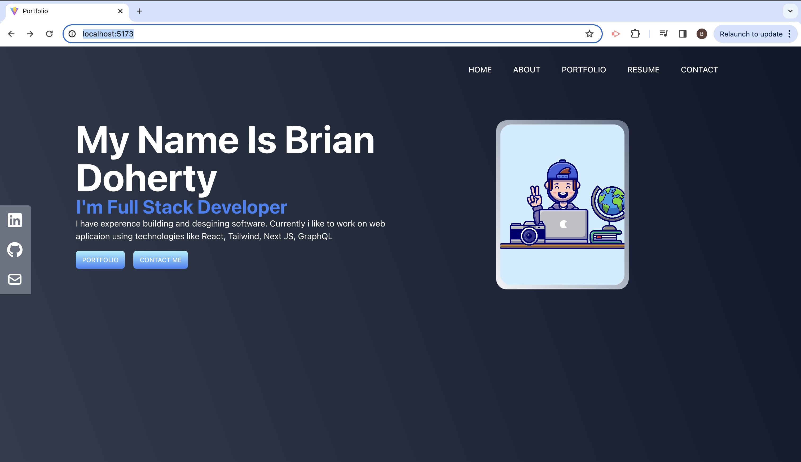
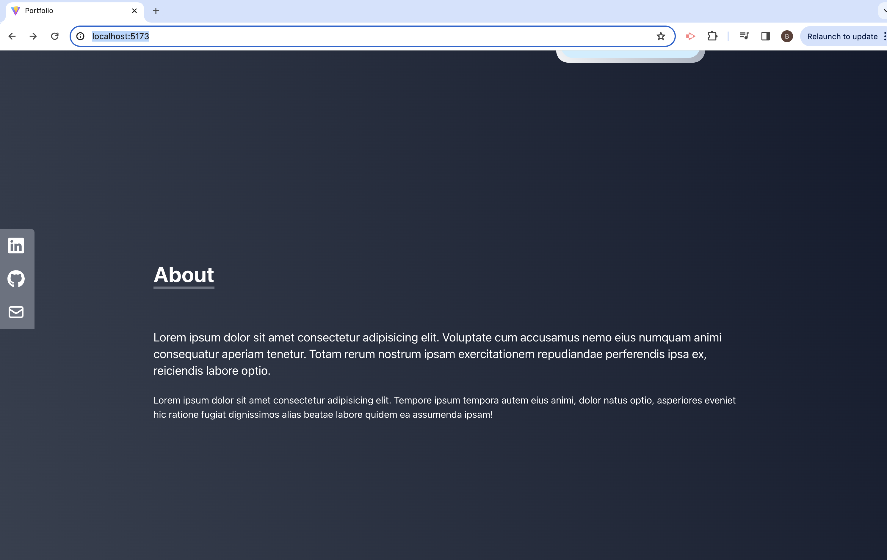
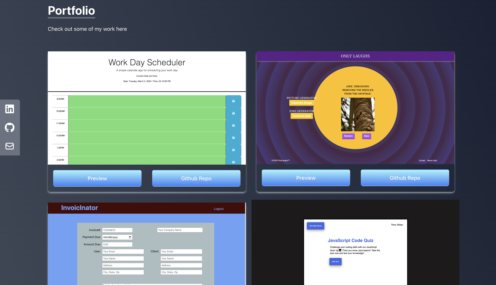
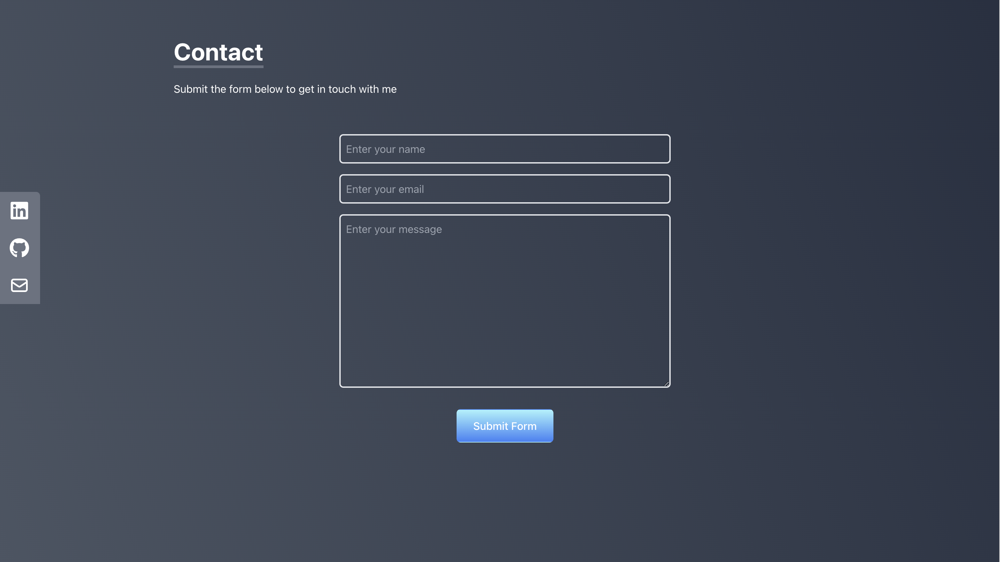

# Welcome to My React Portfolio!

## About

Welcome to my React Portfolio! This portfolio showcases my skills and projects as a web developer, utilizing React and Vite for development and deployed on Netlify for accessibility.

## Features

- **Responsive Design**: Mobile-first design approach ensures optimal viewing experience across devices.
- **Navigation**: Easily navigate through different sections of the portfolio using the navigation bar.
- **Project Showcase**: View a collection of my projects with links to deployed applications and GitHub repositories.
- **Contact Form**: Reach out to me directly via the contact form.
- **Resume**: Download my resume to learn more about my skills and experience.

## Getting Started

To start exploring my portfolio:

1. Visit [Portfolio](#) to see my projects.
2. Check out my [Resume](#) to learn more about my skills and experience.
3. Contact me via the [Contact Form](#) for inquiries or opportunities.

## Technologies Used

- React
- Vite
- Tailwind
- Netlify

=

## Future Dev
- Working on deploying it on netlify

## Feedback

If you have any feedback or suggestions for improvement, feel free to open an issue or reach out to me directly.

Thank you for visiting! 